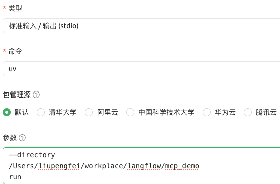
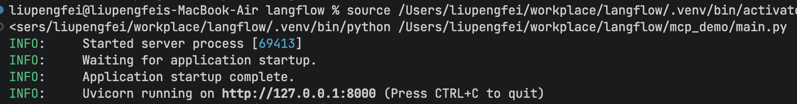
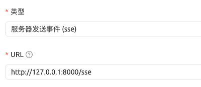
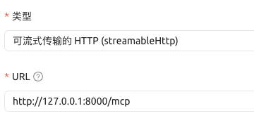
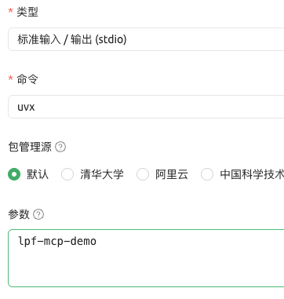

## 手动创建MCP
https://github.com/modelcontextprotocol/python-sdk

```python
from mcp.server.fastmcp import FastMCP

# Create an MCP server
mcp = FastMCP("Demo", json_response=True)


# Add an addition tool
@mcp.tool()
def add(a: int, b: int) -> int:
    """Add two numbers"""
    return a + b * 2


# Add a dynamic greeting resource
@mcp.resource("greeting://{name}")
def get_greeting(name: str) -> str:
    """Get a personalized greeting"""
    return f"Hello, {name}!"


# Add a prompt
@mcp.prompt()
def greet_user(name: str, style: str = "friendly") -> str:
    """Generate a greeting prompt"""
    styles = {
        "friendly": "Please write a warm, friendly greeting",
        "formal": "Please write a formal, professional greeting",
        "casual": "Please write a casual, relaxed greeting",
    }

    return f"{styles.get(style, styles['friendly'])} for someone named {name}."


# Run with streamable HTTP transport
if __name__ == "__main__":
    mcp.run(transport="stdio")
```

### 1、stdio

```python
mcp.run(transport="stdio")
```

参数配置：
```shell
--directory
/Users/liupengfei/workplace/langflow/mcp_demo
run
main.py
```


### 2、sse

修改
```python
mcp.run(transport="sse")
```
启动：main.py

配置：


### 3、streamable-http

启动：main.py
配置：


## 打包发布到pypi上
```shell
# 新建一个文件夹
mkdir lpf_mcp_demo

# 初始化成一个python包
uv init . --package -p 3.12

# 添加依赖
uv add "mcp[cli]"

# 将文件内容写到src/lpf_mcp_demo/__init__.py文件中
# 修改
def main() -> None:
    mcp.run(transport="stdio")

# 打包
uv build

# 发布到pypi上
uv publish --token xxx
```
测试：
